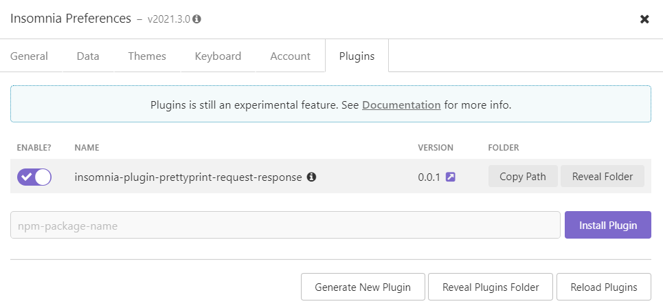
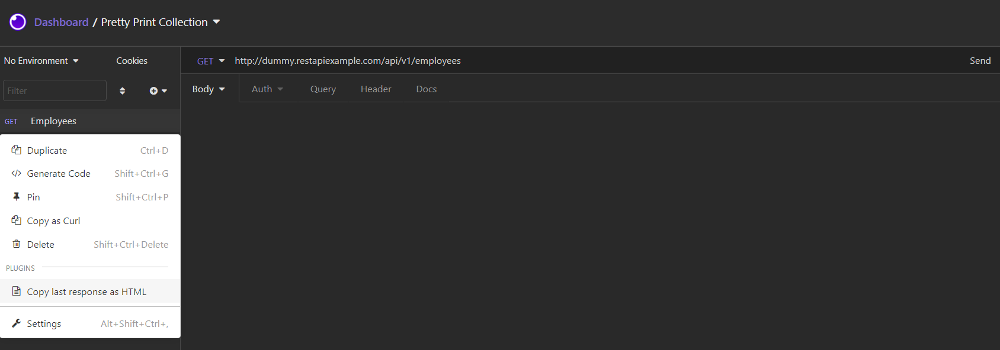
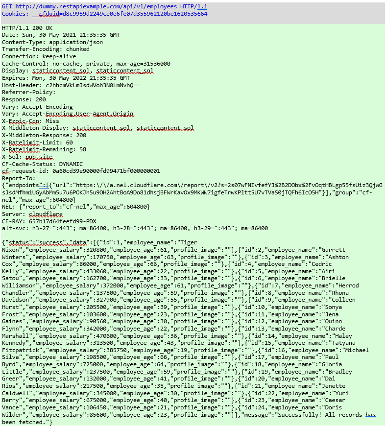
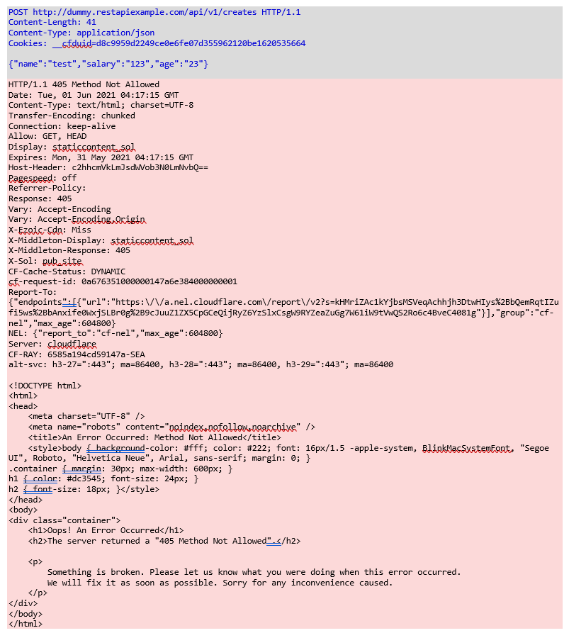

# Insomnia plugin to format request / responses
Format a request / response from within [Insomnia REST Client](https://insomnia.rest/)! The result is copied to the clipboard. Currently, a request / reponse is formatted as HTML and plain text.

# Pre-requisites
This plugin requires [Insomnia](https://insomnia.rest/), the Open Source API client.

# Installation
1. Start Insomnia,
2. Click "Application" -> "Preferences" and choose the "Plugins" tab,
3. Enter `insomnia-plugin-prettyprint-request-response` and click "Install Plugin",

    

4. Close the dialog.

# Usage
1. Go to a request in any collection,
2. Click on the request drop down menu and select `Copy last response as HTML`. The request and last response are copied to the clipboard:

   

4. Switch to any application capable of accepting HTML from the clipboard and paste. Requests are formatted based on the response code. The following examples show a request / response rendered in a new Microsoft Word document:

   * Success responses codes are formatted over a green background:

      

   * Failed response codes are formatted over a red background:

      
   

# Limitations and known issues
This plugin works by exporting the request as HAR and formatting the result. There are currently a few known limitations or known issues which can cause the plugin to fail. These are due to [Insomnia Plugin APIs](https://support.insomnia.rest/article/173-plugins) limitations or bugs. This list will be updated as issues are addressed or new APIs become available:

* Only the last response can currently be exported. Insomnia plugin APIs do not allow acessing the currently selected response in the response drop down,
* Formatting the request may fail if *any* request in *any* Insomnia collection fails to export. Insomnia plugin APIs do not currently allow to export one request / response from a request action plugin.

# Future Improvements
Enhancements include:

* Various formatting themes,
* Format HTTP client errors differently then HTTP server errors,
* Allow request / response body trimming,
* Obfuscate / hide headers related to Personally Identifiable Information or secrets (`Authorization`, ...).
